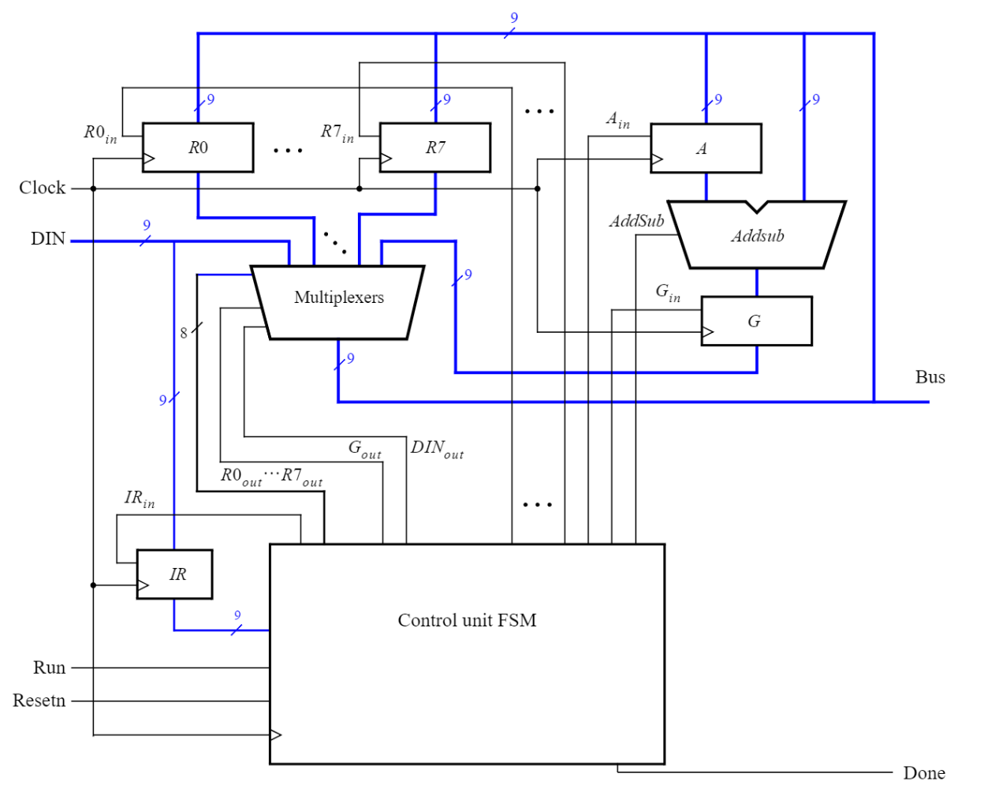

# Cute Processor
Tiny, cute, the first ever Kazakhstani microprocessor 😊

This project is inspired by Altera's lab and implements the following design in verilog:

## Requirements
* make
* verilator

## Build
`make all`
